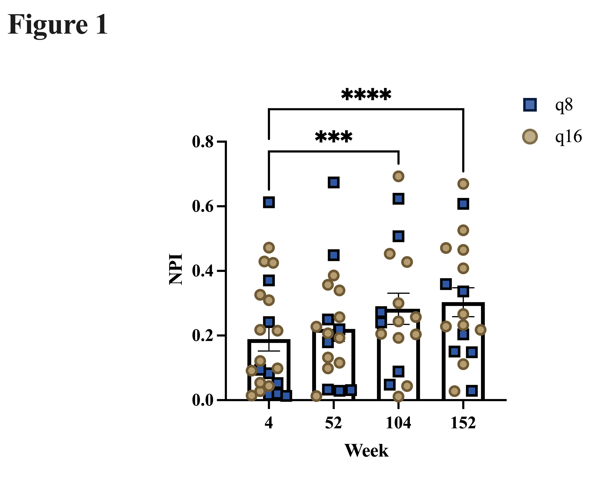
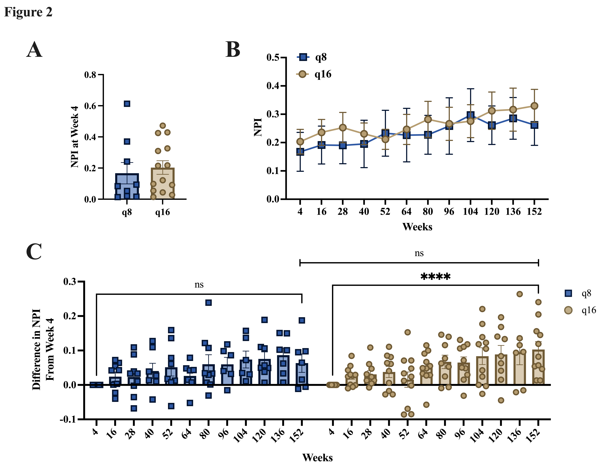
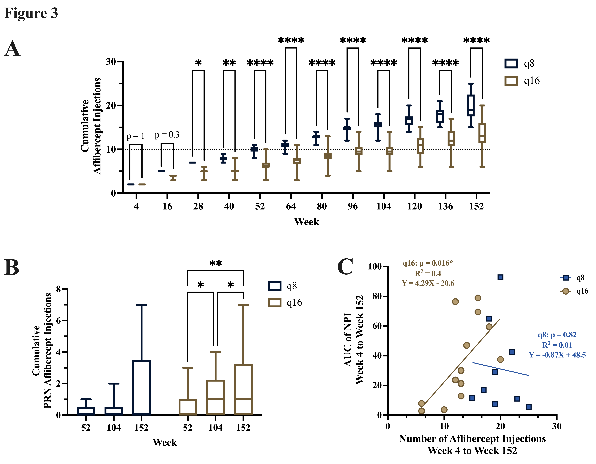
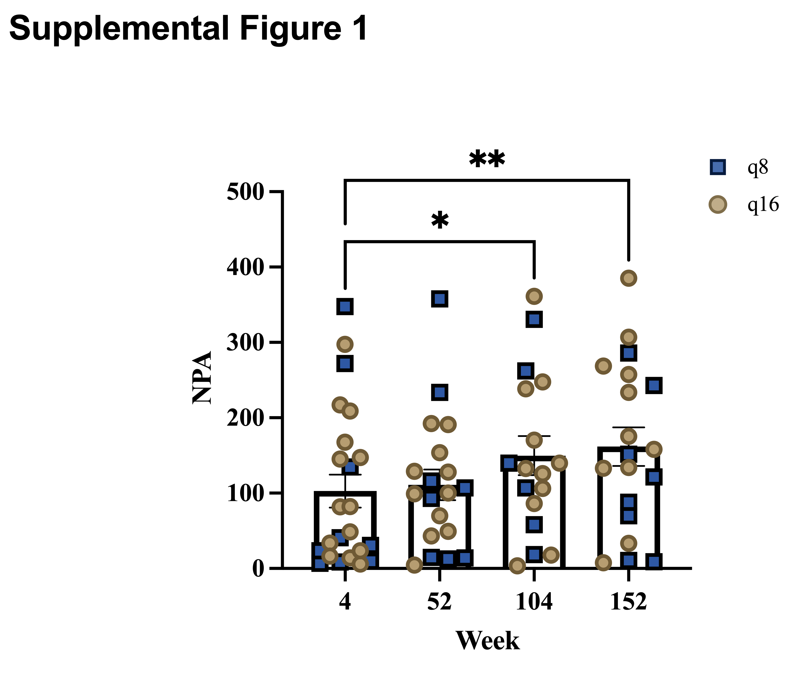

# Endolaserless

## Overview

This repository is the canonical local codebase for the broader Endolaserless analysis workspace around the Laserless Study (NCT02976012), a prospective randomized trial of aflibercept monotherapy after endolaserless vitrectomy for proliferative diabetic retinopathy-related vitreous hemorrhage.

The project currently has two analysis tracks:

- `npi_project`: the active nonperfusion index (NPI) and PRN injection workflow that supports the submitted manuscript
- `neovascularization_project`: an intentionally scaffold-only track whose endpoint inventory, processed tables, and analysis pipeline have not been finalized yet

The local repo is the source of truth for scripts and workflow definitions. Historical OpenSpec records remain as project context; new changes use Superpowers plans and test-driven development.

## Runtime Configuration

Path resolution is centralized in `scripts/project_paths.R`. It supports:

- `ENDOLASERLESS_CODE_ROOT`
- `ENDOLASERLESS_RUNTIME_ROOT`
- `ENDOLASERLESS_CLOUD_ROOT`

Canonical raw inputs live under `Project Vault/Research/endolaserless/data/raw`. The cloud `outputs` directory is an explicit durable publication destination and is not written by ordinary analysis runs.

## Architecture

The project is split across three roles:

1. Local repo
   Holds canonical scripts, lightweight README figures, and OpenSpec artifacts.
2. Runtime directory
   Holds regenerated processed workbooks, logs, scratch outputs, and other non-synced analysis artifacts.
3. Project Vault record tree
   Holds canonical raw inputs and, after an explicit publish action, selected durable outputs copied from runtime.

## Track Layout

### NPI Track

Main entry points:

- `scripts/endolaserless_analysis-2.R`
- `scripts/count_prn_injections.R`

Key runtime destinations:

- Canonical processed branch: `processed_data/npi_project/output-week4_week16_baseline`
- Canonical analysis output branch: `output/npi_project/output-week4_week16_baseline`
- Canonical PRN export branch: `output/npi_project/count_prn_injections`
- Archived compatibility branch: `processed_data/npi_project/archive/output-week4_baseline-legacy-20260408`

### Neovascularization Track

Scaffold entry point:

- `scripts/neovascularization_project.R`

Expected runtime destinations:

- `processed_data/neovascularization_project`
- `output/neovascularization_project`

This track is exploratory and incomplete. Its audit script is preserved but is not part of the established real-data workflow. The local helper creates runtime layout and previews publishable mirrors without writing to Project Vault by default.

## Code And Archive Boundaries

- Keep analysis code in this local repo.
- Keep regenerated workbooks, logs, caches, and scratch outputs in the runtime root.
- Publish selected artifacts from runtime to `Project Vault/Research/endolaserless/outputs` only through an explicit reviewed action.
- Treat repo `docs/*.png` as lightweight display mirrors for the README, not as canonical figure-generation sources.
- Keep cross-project admin backups out of project runtime roots when possible.

For neovascularization published mirrors, transient files such as logs, caches, temp files, and `.DS_Store` should not be copied.

## NPI Status

The current NPI workflow supports these descriptive and associational findings:

- retinal nonperfusion increased over 3 years despite anti-VEGF therapy
- q16 eyes showed significant progression while q8 eyes did not
- q16 eyes required more PRN rescue injections
- in q16, higher cumulative injections were associated with greater NPI burden

Current publication-display figures in this repo:

## Usage

1. Ensure R and the required packages are installed.
2. Confirm the required raw inputs are present under `Project Vault/Research/endolaserless/data/raw`.
3. Run scripts from the local repo.
4. Review runtime outputs before mirroring any publication-facing artifacts into repo `docs/` or an optional external publish destination.

Typical entry points:

- `Rscript scripts/latest_data_intake_audit.R`
- `Rscript scripts/endolaserless_analysis-2.R`
- `Rscript scripts/count_prn_injections.R`
- `Rscript tests/run_tests.R`
- `Rscript -e "parse('scripts/neovascularization_data_audit.R'); source('scripts/neovascularization_project.R')"`

## Validation Notes

- `Rscript tests/run_tests.R` checks canonical path resolution and output-boundary behavior without opening research data.
- Validation should include checking both direct script outputs and downstream artifacts that consume them.
- `scripts/latest_data_intake_audit.R` writes a read-only intake report plus inventory CSVs under `output/npi_project/latest_data_intake_audit`.
- `scripts/endolaserless_analysis-2.R` writes the canonical processed NPI branch under `processed_data/npi_project/output-week4_week16_baseline/`.
- `scripts/count_prn_injections.R` reads the canonical processed NPI cache from that branch and writes PRN exports under `output/npi_project/count_prn_injections`.
- The week4-only compatibility branch is archive-only under `processed_data/npi_project/archive/`.

## Dependencies

Common packages include:

- `tidyverse`
- `readxl`
- `openxlsx`
- `ggplot2`
- `ggprism`
- `lmerTest`

Additional statistical packages are specified in the scripts that use them.

## License

This repository contains research analysis code. Please contact the authors for usage permissions.
